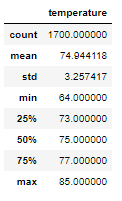
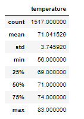

# **surfs_up**

## **Overview of the analysis**

in this porject we wil need to gather more information about temperature trends; in particular, the temperature for June and December in Oahu.

## **Results**

- **In June:**
- Mean  74.9
- Max   85
- Min   64
- Total Count   1700

 

- **In December:**
- Mean   71.04
- Max    83
- Min    56
- Total Count   1517

 

## **Summary**

In this analysis I noticed that we need to run more queries to have a more conclusive decision since all we got is the Temperature data which might directly affect ice cream sales ;however , for the surf part there are other factors such as wind spead and tides.

